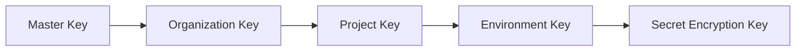

# CF Secret Manager

## Vision

CF Secret Manager is an open-source, Cloudflare-native secrets management platform.
It provides a single source of truth for application secrets while remaining deployable entirely on Cloudflare's serverless stack.
The project is designed to solve a common problem:

Developers store secrets in many places:

- .env files
- GitHub Secrets
- Cloudflare Secrets
- AWS Secrets Manager
- Kubernetes Secrets
- Vercel Environment Variables

Over time these become inconsistent, difficult to audit, and hard to rotate.
CF Secret Manager becomes the authoritative source and can synchronize secrets to external platforms.

---

# Design Principles

## Open Source First

The project must be fully self-hostable.
No proprietary cloud services.
A user should be able to fork the repository and deploy it to their own Cloudflare account.

---

## Cloudflare Native

Infrastructure should leverage:

- Workers
- D1
- R2
- Durable Objects
- Queues
- Cron Triggers

No containers.
No Kubernetes.
No VM infrastructure.

---

## Security First

Plaintext secrets should never be persisted.
All secret values must be encrypted before storage.
Every access should be auditable.

---

## Developer Experience

Primary interfaces:

- Dashboard
- CLI
- SDK

The CLI experience should be considered a first-class feature.

---

# High-Level Architecture

```
                        ┌───────────────┐
                        │  Dashboard    │
                        └───────┬───────┘
                                │
                        ┌───────▼───────┐
                        │  Worker API   │
                        └───────┬───────┘
        ┌───────────────────────┼───────────────────────┐
        │                       │                       │
        ▼                       ▼                       ▼
       D1                      R2            Durable Objects
 (Metadata)         (Encrypted Blobs)        (Coordination)
```

---

# Core Concepts

## Organization

Top-level ownership boundary.

```text
company-1 
company-2 
personal 
```

---

## Project

Logical application grouping.
```text
api
frontend
payments
```

---

## Environment

Deployment environment.
```
development 
staging 
production
```

---

## Secret

Encrypted value stored within an environment.
```
DATABASE_URL 
JWT_SECRET 
STRIPE_API_KEY
```

---

## Machine Token

Credential used by applications and CI systems.

```cfsm_prod_abc123``` 

Machine tokens are scoped to:

- Organization
- Project
- Environment

---

# Infrastructure Components

## Worker API

Acts as the system control plane.

Responsibilities:

- Authentication
- Authorization
- Encryption
- Secret retrieval
- Secret mutation
- Audit generation
- Sync orchestration

Public API:

/v1/auth /v1/projects /v1/environments /v1/secrets /v1/tokens /v1/audit /v1/integrations 

---

## D1

Stores metadata only.

Never stores plaintext secrets.

**Tables:**

- `users`
- `organizations`
- `projects`
- `environments`
- `roles`
- `machine_tokens`
- `secrets`
- `secret_versions`
- `audit_logs`
- `integrations`

---

## R2

Stores encrypted secret payloads.

**Example object:**

```json
{
  "ciphertext": "...",
  "nonce": "...",
  "algorithm": "AES-256-GCM",
  "version": 3
}
```

Advantages:

- Cheap storage
- Unlimited growth
- Version history support

---

## Durable Objects

Used for coordination.

Examples:

### SecretLockDO

Prevents concurrent updates to the same secret.

### RotationDO

Coordinates secret rotation jobs.

### SyncDO

Ensures only one synchronization job executes per integration.

---

## Queues

Used for asynchronous workloads.

**Examples:**

- `audit-events`
- `rotation-events`
- `integration-sync-events`

---

# Security Architecture

## Encryption Strategy

Secrets are encrypted before storage.
Storage providers should only see ciphertext.

---

## Key Hierarchy



Or as a bulleted hierarchy:

- **Master Key**
    - **Organization Key**
        - **Project Key**
            - **Environment Key**
                - **Secret Encryption Key**

Benefits:

- Isolation
- Scoped rotation
- Future multi-tenancy support

---

## Encryption Algorithm

AES-256-GCM

Every secret receives:

Random nonce Encryption key Ciphertext Version 

---

## Key Storage

Initial MVP:

Worker Environment Secret 

Future:

Cloudflare KMS (when available) External KMS integrations 

---

# Secret Lifecycle

## Create Secret

CLI:

cfsm secret set DATABASE_URL 

**Flow:**

| Step | Description          |
|------|----------------------|
|  1.  | **Client**           |
|  2.  | **API**              |
|  3.  | **Encrypt**          |
|  4.  | **Store Blob**       |
|  5.  | **Store Metadata**   |
|  6.  | **Audit Event**      |

Or as a sequence:

```
Client → API → Encrypt → Store Blob → Store Metadata → Audit Event
```

## Read Secret

CLI:

cfsm secret get DATABASE_URL 

**Flow:**

1. **Authenticate**
2. **Load Metadata**
3. **Load Blob**
4. **Decrypt**
5. **Return Secret**
6. **Write Audit Event**

---

## Rotate Secret

CLI:

bash cfsm secret rotate DATABASE_URL 

**Flow:**

| Step | Description                |
|------|----------------------------|
|  1.  | Create New Version         |
|  2.  | Store New Blob             |
|  3.  | Update Current Pointer     |
|  4.  | Archive Previous Version   |
|  5.  | Generate Audit Event       |

Or as a sequence:

```
Create New Version → Store New Blob → Update Current Pointer → Archive Previous Version → Generate Audit Event
```

---

## Delete Secret

**Flow:**

1. **Soft Delete**
2. **Retention Window**
3. **Permanent Cleanup Job**

---

# Authentication

## Dashboard Users

Supported providers:

- Email login
- GitHub OAuth (FUTURE)

---

## Machine Authentication

Machine tokens:

cfsm_prod_xxxxxxxxxxxxx 

Scopes:

read write rotate admin 

---

# Authorization

Role Based Access Control

Roles:

### Owner

Full access

### Admin

Manage project resources

### Developer

Manage secrets

---

# Audit Logging

Every action generates an event.

**Examples:**

- `SECRET_CREATED`
- `SECRET_UPDATED`
- `SECRET_READ`
- `SECRET_ROTATED`
- `TOKEN_CREATED`
- `USER_ADDED`

### Event Structure

An audit event has the following JSON structure:

```json
{
  "actor": "user_123",
  "action": "SECRET_READ",
  "resource": "DATABASE_URL",
  "timestamp": "...",
  "ip": "..."
}
```

---

# CLI

## Goals

The CLI should be the preferred interface.

---

## Authentication

```bash
cfsm login
```

---

## Projects

- Create a project:
  ```bash
  cfsm project create sportsbook
  ```
- List projects:
  ```bash
  cfsm project list
  ```

---

## Environments

- Create a production environment:
  ```bash
  cfsm env create production
  ```
- Create a staging environment:
  ```bash
  cfsm env create staging
  ```

---

## Secrets

- Set a secret:
  ```bash
  cfsm secret set DATABASE_URL
  ```
- Get a secret:
  ```bash
  cfsm secret get DATABASE_URL
  ```
- Delete a secret:
  ```bash
  cfsm secret delete DATABASE_URL
  ```
- Rotate a secret:
  ```bash
  cfsm secret rotate DATABASE_URL
  ```

---

## Runtime Injection

```bash
cfsm run --env production npm start
```

**Result:**
```
DATABASE_URL injected
JWT_SECRET injected
STRIPE_KEY injected
```

---

# SDK

## TypeScript

```typescript
import { Client } from 'cfsm-sdk';

const client = new Client("master-token");
const secret = await client.secret("DATABASE_URL");
```

---

## Go

```go
secret, err := client.Secret("DATABASE_URL")
if err != nil {
    // handle error
}
```

---

# API Design

## API Endpoints

### Create Secret

- **Endpoint:**  
  `POST /v1/secrets`

- **Request Body:**
  ```json
  {
    "name": "DATABASE_URL",
    "value": "postgres://..."
  }
  ```

---

### Get Secret

- **Endpoint:**  
  `GET /v1/secrets/DATABASE_URL`

---

### Rotate Secret

- **Endpoint:**  
  `POST /v1/secrets/DATABASE_URL/rotate`

---

### List Secrets

- **Endpoint:**  
  `GET /v1/secrets`

---

# Versioning

Every update to a secret creates a new version.

**Example:**

| Secret Name    | Versions                |
| -------------- | ----------------------- |
| `DATABASE_URL` | v1 > v2 > v3 -> v4 |

- **Retention Policy:**  
  Retention of secret versions is configurable per project.

# Future Features

## Secret Templates

Secret templates allow you to define and reuse common secret names when bootstrapping new projects.

**Example Templates:**

- `DATABASE_URL`
- `REDIS_URL`
- `JWT_SECRET`

These reusable templates simplify project setup and ensure consistency across environments.

---

## Rotation Policies

Supported rotation intervals:

- **30 days**
- **60 days**
- **90 days**

#### Expiring Secrets

Secrets can be set to automatically expire and become invalid after a defined period.

---

## Webhooks

Certain events in the system can trigger webhooks. Supported event types include:

- `secret.created`
- `secret.updated`
- `secret.rotated`
- `secret.deleted`

---

## Terraform Provider

Example usage with the Terraform provider:

```hcl
resource "cfsm_secret" "database" {
  name = "DATABASE_URL"
}
```

---

# MVP Scope

## Phase 1
- **Worker API**
- **Dashboard**
- **D1 metadata**
- **R2 encrypted blobs**
- **GitHub authentication**
- **CLI**
- **Secret CRUD**
- **Secret retrieval**
- **Audit logging**

## Phase 2
- **RBAC**
- **Versioning**
- **Machine tokens**
- **SDK**

## Phase 3
- **Cloudflare sync**
- **Rotation engine**
- **Terraform provider**
- **Webhooks**

---

# Success Criteria

A developer should be able to:

```bash
cfsm login
cfsm project create api
cfsm env create production
cfsm secret set DATABASE_URL
cfsm run --env production npm start
```

**Without:**
- Managing infrastructure
- Running Kubernetes
- Operating Vault clusters
- Using multiple secret stores

> The system should provide a single source of truth for secrets while remaining deployable entirely on Cloudflare.